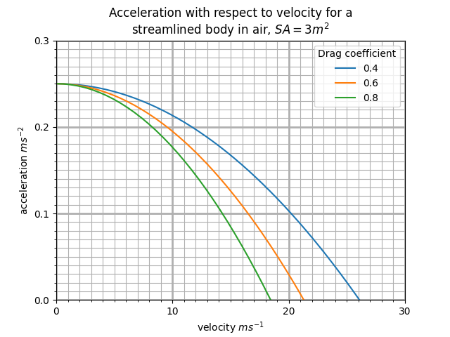

# dragsweep

**Acceleration-versus-velocity curves for a thrusting body under quadratic aerodynamic drag.**


`dragsweep` answers one question: *as a body under constant thrust speeds up, how fast does its acceleration bleed away, and how much does the shape of the body change that?*

It sweeps a list of drag coefficients, plots one acceleration curve per coefficient on shared axes, and saves the figure to disk. The point where a curve meets the x-axis is that body's top speed.



---

## Contents

- [The physics](#the-physics)
- [Quick start](#quick-start)
- [Parameters](#parameters)
- [Reading the output](#reading-the-output)
- [Assumptions and limitations](#assumptions-and-limitations)
- [Project structure](#project-structure)
- [Compatibility note](#compatibility-note)
- [Possible extensions](#possible-extensions)
- [References](#references)
- [License](#license)

---

## The physics

Aerodynamic drag on a bluff body at high Reynolds number follows the [drag equation](https://en.wikipedia.org/wiki/Drag_equation):

$$F_d = \tfrac{1}{2}\,\rho\,v^2 C_d A$$

Drag rises with the **square** of velocity, which is the single fact the whole plot is about. Applying Newton's second law to a body driven forward by a constant thrust $T$:

$$a(v) = \frac{T - \tfrac{1}{2}\rho v^{2} C_d A}{m}$$

In words: acceleration is thrust minus drag, divided by mass. Because the drag term is quadratic in $v$, each curve is a downward parabola.

Setting $a(v) = 0$ and solving for $v$ gives the speed at which thrust and drag balance exactly — the body stops accelerating and holds that speed:

$$v_{\text{terminal}} = \sqrt{\frac{2T}{\rho\,C_d A}}$$

A note on the term: *terminal velocity* is usually defined for a body **falling** through a fluid, where the driving force is weight, $mg$. The case here is the same equation with thrust $T$ substituted for $mg$ — a constant driving force balanced against quadratic drag — so the result is a steady-state top speed rather than a free-fall terminal velocity in the textbook sense.

Two consequences worth noticing on the plot:

- **Every curve starts at the same height.** At $v = 0$ there is no drag at all, so $a(0) = T/m$ regardless of drag coefficient. Aerodynamics costs you nothing off the line; it costs you everything at speed.
- **Halving drag does not double top speed.** Because $v_{\text{terminal}} \propto 1/\sqrt{C_d}$, doubling the drag coefficient divides top speed by $\sqrt{2}$, not by 2. The defaults bear this out: $C_d = 0.4$ tops out at 26.08 m/s and $C_d = 0.8$ at 18.44 m/s, a ratio of 1.414.

Symbols: $F_d$ drag force (N), $\rho$ fluid density (kg m⁻³), $v$ velocity relative to the fluid (m s⁻¹), $C_d$ [drag coefficient](https://en.wikipedia.org/wiki/Drag_coefficient) (dimensionless), $A$ reference cross-sectional area (m²), $T$ thrust (N), $m$ mass (kg).

---

## Quick start

```bash
git clone https://github.com/<your-username>/dragsweep.git
cd dragsweep

# Optional but recommended: keep the dependencies out of your system Python
python -m venv .venv
source .venv/bin/activate        # Windows: .venv\Scripts\activate

pip install -r requirements.txt
python dragsweep.py
```

A window opens with the plot. `drag_graph_Cd.png` is written to the working directory at the same time.

Running headless (over SSH, in a container, in CI) with no display attached:

```bash
MPLBACKEND=Agg python dragsweep.py
```

The figure is still saved; only the interactive window is skipped.

---

## Parameters

All parameters live in the `#PARAMETERS` block near the top of `dragsweep.py`. Edit the values there and re-run — there is no configuration file and no command-line interface by design, so that the script stays readable top to bottom.

| Constant | Meaning | Unit | Default |
|---|---|---|---|
| `DRAG_COEFFICIENTS` | The coefficients to sweep. **One curve is drawn per entry**, so adding a fourth value adds a fourth line automatically. | dimensionless | `[0.4, 0.6, 0.8]` |
| `CS_area` | Reference cross-sectional area — the frontal area the flow sees. | m² | `3` |
| `fluid_density` | Density of the fluid the body moves through. Change it to model something other than air. | kg m⁻³ | `1.225` |
| `velocity_max` | Right-hand edge of the velocity axis. | m s⁻¹ | `30` |
| `mass` | Mass of the moving body. | kg | `2000` |
| `thrust` | Constant propulsive force. | N | `500` |

Reference values, with sources attached so you can check them rather than take them on trust:

| Body | Drag coefficient | Source |
|---|---|---|
| Average modern automobile | 0.25 – 0.30 | [Automobile drag coefficient](https://en.wikipedia.org/wiki/Automobile_drag_coefficient) |
| Sport utility vehicles, typically boxy shapes | 0.35 – 0.45 | as above |
| 2018 Jeep Wrangler (JL) | 0.454 | as above |
| Flat plate perpendicular to flow (3D) | 1.28 | [Drag coefficient](https://en.wikipedia.org/wiki/Drag_coefficient) |

Worth knowing when choosing values: the defaults sweep 0.4 to 0.8, and only the bottom of that range overlaps real production vehicles. A coefficient of 0.6 or above is closer to a van, a flat-fronted truck, or a car carrying a roof box than to any modern car or SUV.

**Fluid densities:** 1.225 kg m⁻³ for air at sea level and 15 °C (the International Standard Atmosphere value, already set in the script); roughly 997 kg m⁻³ for fresh water at 25 °C.

**If a curve never reaches the x-axis,** the body's top speed lies beyond the right edge of the plot. Raise `velocity_max` until the crossing appears.

---

## Reading the output

With the default parameters — a 2000 kg body, 3 m² frontal area, 500 N of thrust, moving through air:

| Drag coefficient | Acceleration at rest | Top speed | |
|---|---|---|---|
| 0.4 | 0.25 m s⁻² | 26.08 m s⁻¹ | ≈ 58 mph |
| 0.6 | 0.25 m s⁻² | 21.30 m s⁻¹ | ≈ 48 mph |
| 0.8 | 0.25 m s⁻² | 18.44 m s⁻¹ | ≈ 41 mph |

The curves are flat near the origin and steepen as they fall. That shape is the practical message: at low speed, drag is almost irrelevant and mass dominates; past roughly half of top speed, drag is eating most of the thrust and further gains get expensive.

Note that 500 N is a deliberately modest thrust for a 2000 kg vehicle — about 0.025 g. The defaults are chosen to put terminal velocity inside a readable 0–30 m s⁻¹ window, not to model a specific car.

---

## Assumptions and limitations

Stated plainly, because the model is simple enough that knowing its edges matters more than the code does.

- **This plots a function; it does not simulate motion over time.** The script evaluates $a(v)$ across a range of velocities. It never integrates the equation of motion, so it produces no $v(t)$ and no distance travelled, and `velocity_max` is a plot range rather than a physical speed limit.
- **Thrust is constant.** Real engines are power-limited, so available force falls roughly as $1/v$ once past peak torque. This model therefore overstates acceleration at the high end for anything with a real powertrain.
- **Drag is the only resistance modelled.** No rolling resistance, no drivetrain losses, no gradient, no headwind.
- **$C_d$ and $A$ are treated as constants.** In reality the drag coefficient varies with Reynolds number and with yaw angle, and frontal area changes as a vehicle pitches or a body rotates.
- **Quadratic drag assumes high-Reynolds-number flow.** In the creeping-flow regime drag is linear in velocity instead, and this equation does not apply.
- **One dimension, horizontal.** No gravity component, no lift, no cornering.
- **The y-axis floor is zero.** Past terminal velocity the acceleration is negative — the body decelerates — but that region is clipped out of view rather than drawn.
- **Axis tick spacing is hardcoded.** The y-axis locators are fixed at 0.1 major and 0.01 minor, tuned for the default $a(0) = 0.25$ m s⁻². Change `thrust` or `mass` by an order of magnitude and the gridlines become unreadably dense or uselessly sparse. If that happens, delete the four `set_major_locator` / `set_minor_locator` lines and add `ax.minorticks_on()`; matplotlib then chooses sensible spacing for whatever the values are.

---

## Project structure

```
dragsweep/
├── dragsweep.py       # the model (accel_func) and the plotting script
├── example.png        # figure produced by the default parameters
├── requirements.txt   # numpy, matplotlib, with the version floor the code needs
├── .gitignore         # ignores the run output, keeps example.png
├── LICENSE            # MIT
└── README.md
```

The single meaningful function is:

```python
accel_func(thrust, mass, C_d, CS_area, fluid_density, velocity)
```

It is fully vectorised — pass a NumPy array of velocities and get an array of accelerations back — which is why the whole sweep needs no inner loop over velocity values.

---

## Compatibility note

The plotting code calls `ax.grid(visible=True, ...)`. That keyword was named `b` in older matplotlib: it was **renamed to `visible` in matplotlib 3.5.0** and the old spelling was **removed in 3.7.0**.

The practical consequence is worth recording, because the failure is not obvious from the error message. On matplotlib 3.7 or newer, the old `ax.grid(b=True, ...)` call does not raise a clean "unknown argument" error at the call site. It is swallowed into `**kwargs`, prefixed, and surfaces much deeper in the stack as:

```
ValueError: keyword grid_b is not recognized; valid keywords are ['size', 'width', 'color', ...]
```

If you encounter that error in any older matplotlib script, the fix is to rename `b=` to `visible=`. `requirements.txt` pins `matplotlib>=3.5` for this reason — below that version, `visible` does not exist.

---

## Possible extensions

Deliberately not implemented, listed for anyone who wants to take the model further:

- **Integrate to get motion over time.** `scipy.integrate.cumulative_trapezoid` over `1/a(v)` yields time-to-speed, turning the plot into a 0–60 figure.
- **Sweep a different variable.** The loop is indifferent to which parameter varies; sweeping `mass` or `thrust` instead of `C_d` is a small edit.
- **Model speed-dependent thrust.** Replacing the constant `thrust` with a power-limited $T(v) = P/v$ makes the top end considerably more realistic.

---

## References

- [Drag equation](https://en.wikipedia.org/wiki/Drag_equation) — Wikipedia
- [Drag coefficient](https://en.wikipedia.org/wiki/Drag_coefficient) — Wikipedia, including a table of measured values for real vehicles and shapes
- [Terminal velocity](https://en.wikipedia.org/wiki/Terminal_velocity) — Wikipedia
- [`numpy.linspace`](https://numpy.org/doc/stable/reference/generated/numpy.linspace.html) — NumPy documentation
- [`matplotlib.axes.Axes.grid`](https://matplotlib.org/stable/api/_as_gen/matplotlib.axes.Axes.grid.html) — matplotlib documentation
- [matplotlib 3.5.0 API changes](https://matplotlib.org/stable/api/prev_api_changes/api_changes_3.5.0.html) — the `b` to `visible` rename
- [matplotlib 3.7.0 API changes](https://matplotlib.org/stable/api/prev_api_changes/api_changes_3.7.0.html) — removal of the deprecated `b`

---

## License

Released under the MIT License. See [LICENSE](LICENSE).
